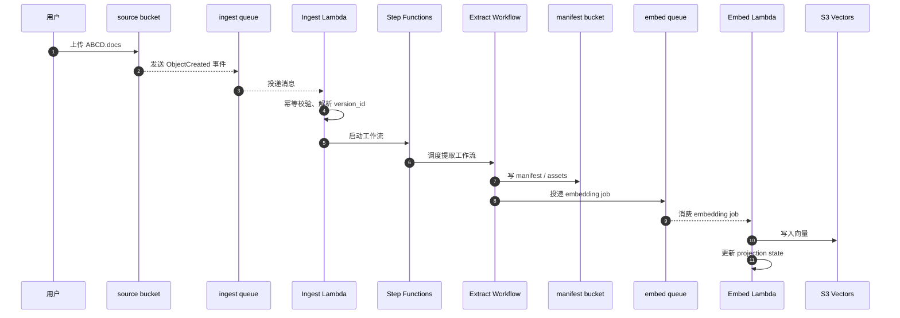
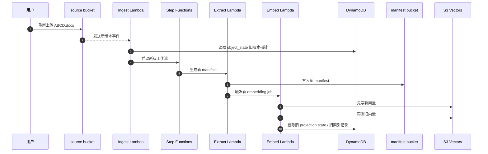
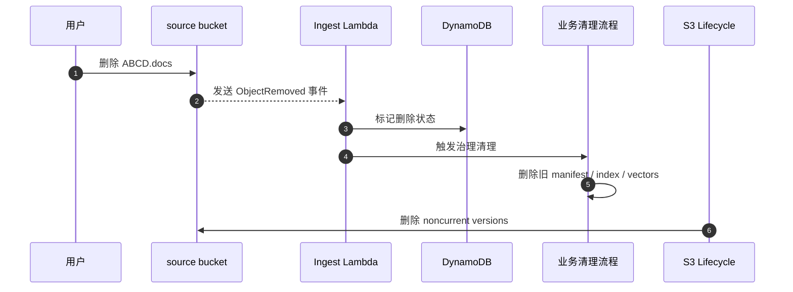

# AWS 控制台手动部署教程

本教程只保留 AWS 控制台手工部署的参考路径，适合排障、对照和补充验证。

当前仓库的正式交付口径仍以 GitHub Actions 和部署脚本为准；这份文档只作为手工部署和运行时对照参考，不是唯一交付入口。

如果你要部署的是本仓库当前这套文档处理系统，先记住下面几条：

- 文档主身份必须带 `version_id`，不能只按文件名或路径建模。
- `source bucket` 必须开启 `S3 Versioning`。
- `source bucket` 的当前版本上传后 `1` 天转到 `S3 Intelligent-Tiering`，历史版本仍然只靠 `S3 Lifecycle` 删除 `noncurrent versions`。
- `manifest bucket` 负责保存结构化提取结果、切片资产和可回放材料，不替代 `S3 Vectors`。
- ZIP 包命名已经改成 `<repo-name>_<function>.zip`，例如 `serverless-ocr-s3vectors-mcp_ingest.zip`。
- 共享第三方依赖现在优先放进 3 个 Lambda Layer，Lambda ZIP 只保留项目代码和入口包装层。
- 当前推荐对外入口仍然是 `Ingest Lambda`，其后由 `Step Functions Standard` 编排提取流程。

---

## 1. 系统总览

### 1.1 目标架构

当前默认运行时为：

`source bucket -> S3 Event Notification -> SQS ingest queue -> Ingest Lambda -> Step Functions Standard -> extract workflow lambdas -> manifest bucket -> SQS embed queue -> Embed Lambda -> SQS DLQ`

其中：

- `Ingest Lambda` 只负责入口治理、幂等预检查和启动工作流。
- `Step Functions Standard` 负责提取、轮询、落 manifest、推进状态并投递 embedding 任务，内部实际串起 `extract_prepare`、`extract_sync`、`extract_submit`、`extract_poll` 和 `extract_persist` 这 5 个工作流 Lambda。
- `Embed Lambda` 负责写入 `S3 Vectors`，并在新版本成功后清理旧版本派生物。
- `Remote MCP Lambda` 负责远程 MCP 查询入口。
- `Backfill Lambda` 负责历史 embedding 重放。

### 1.2 资源最小集合

当前最小可用资源拆分优先为：

- 2 个 `S3 bucket`
- 2 个 `SQS queue`
- 1 个 `DLQ`
- 2 张 `DynamoDB` 表
- 6 个 Lambda 标准入口
- 3 个 Lambda Layer
- 1 个 `Step Functions Standard` 状态机

### 1.3 ZIP 命名规则

当前仓库已经从“单一 ZIP”改成“按 Lambda 入口拆 6 个 ZIP”。
第三方依赖则拆进 3 个 Lambda Layer，避免每个 ZIP 重复携带同一批依赖。

统一命名格式：

```text
<repo-name>_<function>.zip
```

示例：

```text
serverless-ocr-s3vectors-mcp_ingest.zip
```

### 1.4 三张时序图

下面三张图把“上传、新版本覆盖、删除对象”从头到尾串起来。当前代码的顺序是：先把新版本和新派生物写进去，再按版本边界清理旧版本派生物；`source bucket` 的当前版本由生命周期在第 `1` 天自动转到 `S3 Intelligent-Tiering`，历史对象版本仍然只靠 S3 Lifecycle 兜底。

#### 图 1：上传到处理完成



#### 图 2：同名文件覆盖



#### 图 3：删除对象



---

## 2. 部署前准备

### 2.1 账号和 Region

1. 所有资源必须在同一个 AWS 账号和同一个 Region 内创建。
2. 先确认目标 Region 支持你要用的服务，尤其是 `Amazon S3 Vectors`。
3. 资源建议统一放在生产账号，避免跨账号调试时权限边界混乱。

### 2.2 凭证和外部 API

至少准备以下凭证：

- `AWS_ACCESS_KEY_ID`
- `AWS_SECRET_ACCESS_KEY`
- `AWS_SESSION_TOKEN`，如果你用的是临时凭证
- `OPENAI_API_KEY`，如果启用了 OpenAI / Azure OpenAI embedding profile
- `OPENAI_API_BASE_URL`，如果启用了 OpenAI / Azure OpenAI embedding profile；Azure OpenAI 兼容性接口可直接填 `https://{resource-name}.openai.azure.com/openai/v1/`
- Lambda 执行 role ARN 由部署脚本按账号 ID + 资源名前缀自动构造，不需要单独配置

当前实现仍然通过 Lambda 环境变量读取这些值。
如果以后改成 `Secrets Manager`，那是另一轮设计，不在本教程展开。

### 2.3 代码包命名和打包脚本

仓库现在不再输出单一 extract worker ZIP，而是按 Lambda 入口拆成 10 个包：

- `ingest`
- `extract_prepare`
- `extract_sync`
- `extract_submit`
- `extract_poll`
- `extract_persist`
- `embed`
- `remote_mcp`
- `backfill`

统一打包脚本位于：

`tools/packaging/serverless_mcp/package_lambda.py`

Layer 打包脚本位于：

`tools/packaging/serverless_mcp/build_layer_artifacts.py`

本地打包示例：

```powershell
py -3.14 .\scripts\serverless_mcp\package_lambda.py --function ingest --repo-name serverless-ocr-s3vectors-mcp
```

每个包都会生成独立 ZIP，并按下面格式命名：

```text
serverless-ocr-s3vectors-mcp_ingest.zip
```

Layer 产物会单独生成到 `services/ocr-pipeline/dist/layers/`，格式如下：

```text
serverless-ocr-s3vectors-mcp_core_layer.zip
serverless-ocr-s3vectors-mcp_extract_layer.zip
serverless-ocr-s3vectors-mcp_embedding_layer.zip
```

### 2.4 推荐部署顺序

| 顺序 | 资源 | 原因 |
| --- | --- | --- |
| 1 | S3 bucket | 先有桶，后有通知和版本生命周期 |
| 2 | SQS queue | 先有队列，后绑定事件和 Lambda |
| 3 | DynamoDB table | 状态推进、幂等、索引都依赖它 |
| 4 | S3 Vectors | 向量写入前要先有 bucket/index |
| 5 | IAM role | Lambda 和 Step Functions 都需要权限 |
| 6 | Step Functions | 提取编排依赖前面资源 |
| 7 | Lambda Layer | 先发布共享依赖，再挂载到各个 Lambda |
| 8 | Lambda function | 最后挂载入口和环境变量 |
| 9 | 事件通知 | 所有下游资源都准备好后再绑 |
| 10 | Remote MCP / CloudFront | 远程 MCP 查询和分发放在最后补齐 |

---


