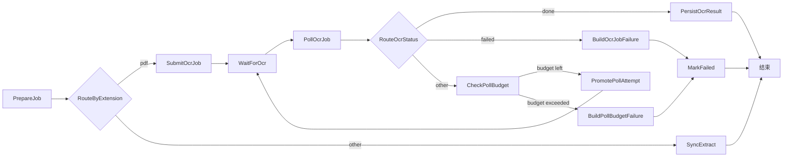

## 1. 创建 Step Functions

### 1.1 这个状态机负责什么

`Step Functions Standard` 是提取主编排，状态机名固定用资源总表里的：

- `mcp-doc-pipeline-prod-sfn-extract`

它负责把 `Ingest Lambda` 交下来的单个文档版本继续编排成完整提取链路：

- 提交 OCR 任务
- 轮询状态
- 拉取结果
- 写 manifest
- 推进状态
- 投递 embedding job

这里说的 `manifest` 不再只是旧的单文件 manifest 结构，而是会一起落下 `manifest.json`、`raw.jsonl`、`document.md` 和本地化后的 `assets/*`，其中图片 URL 会被下载后改写成相对路径。

这个状态机不是空壳，它实际会调用 5 个 extract workflow Lambda，所以在创建之前要先确认：

- `extract workflow lambdas` 已经存在
- `STEP_FUNCTIONS_STATE_MACHINE_ARN` 会回填到 `Ingest Lambda`
- 你准备使用的 `source bucket`、`manifest bucket`、`object_state table`、`manifest_index table` 都已经建好

它接收的输入不是空 JSON，而是 `Ingest Lambda` 传入的两段对象：

- `job`
- `processing_state`

其中 `job.source` 必须至少包含：

- `tenant_id`
- `bucket`
- `key`
- `version_id`
- `sequencer`

如果你手工在控制台里启动一次执行，建议直接复用一条真实对象版本的输入，不要凭空捏造空 payload。

状态机的连接关系如下：



### 1.2 控制台创建

1. 打开 `Step Functions`。
2. 点击 `State machines`。
3. 点击 `Create state machine`。
4. 选择 `Standard`。
5. `State machine name` 填 `mcp-doc-pipeline-prod-sfn-extract`。
6. `Permissions` 这里建议先选 `Create new role`，让控制台自动补齐最小权限。
7. 如果你必须手工选现有角色，至少要给这个角色：
   - `lambda:InvokeFunction`，目标是 `mcp-doc-pipeline-prod-lambda-extract-prepare`、`mcp-doc-pipeline-prod-lambda-extract-sync`、`mcp-doc-pipeline-prod-lambda-extract-submit`、`mcp-doc-pipeline-prod-lambda-extract-poll`、`mcp-doc-pipeline-prod-lambda-extract-persist`
   - `logs:CreateLogDelivery`
   - `logs:GetLogDelivery`
   - `logs:UpdateLogDelivery`
   - `logs:DeleteLogDelivery`
   - `logs:ListLogDeliveries`
   - `logs:PutResourcePolicy`
   - `logs:DescribeResourcePolicies`
   - `xray:PutTraceSegments`
   - `xray:PutTelemetryRecords`
8. `Additional configuration` 里打开：
   - `Enable X-Ray tracing`
   - `Logging`
9. `Logging level` 建议先选 `ALL`。
10. `Log group` 建议使用带前缀的组名，例如：
    - `/aws/vendedlogs/states/mcp-doc-pipeline-prod-sfn-extract`
11. `Include execution data` 建议开启，这样排查输入和输出最直接。
12. `Definition` 选择 `Write your workflow in code`，或者直接导入 JSON。

### 1.3 工作流定义

仓库里已经有相应工作流模板，文件路径是：

`services/ocr-pipeline/src/serverless_mcp/workflows/extract_state_machine.asl.json`

这个模板里有 5 个需要替换的占位符：

- `${PREPARE_LAMBDA_ARN}`
- `${SYNC_LAMBDA_ARN}`
- `${SUBMIT_LAMBDA_ARN}`
- `${POLL_LAMBDA_ARN}`
- `${PERSIST_LAMBDA_ARN}`

你可以直接把这个 JSON 粘进控制台，再把 5 个占位符分别替换成对应函数的实际 ARN。

这里要填写的是 **extract workflow Lambda 的函数 ARN**，不是执行角色 ARN，也不是 Step Functions 自己的 ARN。

如果你的函数用了 alias，控制台里也可以填带 qualifier 的 ARN，例如：

```text
arn:aws:lambda:{region}:{account-id}:function:mcp-doc-pipeline-prod-lambda-extract-submit:live
```

实际值怎么拿：

1. 打开 `Lambda` 控制台。
2. 分别进入 `mcp-doc-pipeline-prod-lambda-extract-prepare`、`mcp-doc-pipeline-prod-lambda-extract-sync`、`mcp-doc-pipeline-prod-lambda-extract-submit`、`mcp-doc-pipeline-prod-lambda-extract-poll` 和 `mcp-doc-pipeline-prod-lambda-extract-persist`。
3. 在函数详情页复制各自的 `Function ARN`。
4. 把这些值分别填回 Step Functions 定义里的 5 个占位符。

如果你当前 Region 是 `ap-southeast-1`，账号是 `123456789012`，那么这些值看起来会分别像：

```text
arn:aws:lambda:ap-southeast-1:123456789012:function:mcp-doc-pipeline-prod-lambda-extract-prepare
arn:aws:lambda:ap-southeast-1:123456789012:function:mcp-doc-pipeline-prod-lambda-extract-sync
arn:aws:lambda:ap-southeast-1:123456789012:function:mcp-doc-pipeline-prod-lambda-extract-submit
arn:aws:lambda:ap-southeast-1:123456789012:function:mcp-doc-pipeline-prod-lambda-extract-poll
arn:aws:lambda:ap-southeast-1:123456789012:function:mcp-doc-pipeline-prod-lambda-extract-persist
```

这个工作流的每个状态分别做什么，下面要写清楚：

| 状态名 | 类型 | 作用 |
| --- | --- | --- |
| `PrepareJob` | `Task` | 初始化 `object_state`，整理 `job` 和 `processing_state` |
| `RouteByExtension` | `Choice` | 按扩展名分流，`pdf` 走 OCR 分支，其他格式走同步抽取分支 |
| `SyncExtract` | `Task` | 非 PDF 文档直接同步抽取、写 manifest、结束 |
| `SubmitOcrJob` | `Task` | 提交 PaddleOCR 异步任务 |
| `WaitForOcr` | `Wait` | 按轮询间隔等待下一次查询 |
| `PollOcrJob` | `Task` | 查询 OCR job 当前状态 |
| `RouteOcrStatus` | `Choice` | 按 `done` / `failed` / 继续等待分流 |
| `BuildOcrJobFailure` | `Pass` | 把 OCR 失败整理成统一错误对象 |
| `CheckPollBudget` | `Choice` | 检查轮询次数是否用尽 |
| `PromotePollAttempt` | `Pass` | 把轮询计数推进到下一轮 |
| `BuildPollBudgetFailure` | `Pass` | 轮询超预算时构造统一失败对象 |
| `PersistOcrResult` | `Task` | 下载 `json_url`，构建 manifest，并持久化结果 |
| `MarkFailed` | `Task` | 把失败状态写回 `object_state`，便于治理和排障 |

如果你想先验证结构对不对，直接看模板里的 4 个关键连接：

- `PrepareJob -> RouteByExtension`
- `RouteByExtension` 的 `pdf` 分支 -> `SubmitOcrJob`
- `RouteByExtension` 默认分支 -> `SyncExtract`
- `PollOcrJob -> RouteOcrStatus -> PersistOcrResult / BuildOcrJobFailure / CheckPollBudget`

这里有一个很重要的实现细节：

- `WaitForOcr` 用的是 `SecondsPath: $.poll_interval_seconds`
- `CheckPollBudget` 用的是 `NumericGreaterThanEqualsPath: $.max_poll_attempts`
- `PollOcrJob` 里的状态查询有单独的短超时，默认 `10 秒`；如果 OCR 服务只是暂时抖动，工作流会继续等下一轮，而不是把单次查询拖到 Lambda 60 秒上限。
- 整个 OCR 轮询预算默认按 `10 分钟` 计算，所以 `poll_interval_seconds = 30` 时，最大轮询次数会被限制在 `20` 次。

`SubmitOcrJob` 不是单纯从 `S3` 下载文件，它还会把整份文档同步提交到外部 `PaddleOCR` API。
所以这里把两层超时分开了：`PADDLE_OCR_HTTP_TIMEOUT_SECONDS` 仍然控制单次提交请求的 HTTP 等待，默认 `60 秒`；`extract workflow Lambda` 各自使用独立函数超时，提交和轮询不会共用同一个 60 秒上限。
现在 `extract workflow Lambdas` 已经补了更细的 CloudWatch 追踪日志，能区分卡在 `fetch`、`submit`、`poll` 还是 `persist`。
`PersistOcrResult` 会先下载 OCR 返回的 `jsonUrl`，再从每个 `layoutParsingResults` 项的 `markdown.text` 组装拆分后的 `.md` 派生文件和 manifest。

也就是说，输入里必须带这两个字段，不然工作流跑到这一步就没有可用值。

建议你在控制台里做一次人工执行前，先准备一份和 `Ingest Lambda` 输出一致的测试输入。下面是最小可用形状：

```json
{
  "job": {
    "source": {
      "tenant_id": "tenant-a",
      "bucket": "mcp-doc-pipeline-prod-s3-source",
      "key": "samples/demo.pdf",
      "version_id": "11111111111111111111111111111111",
      "sequencer": "0065F3A1B2C3D4E5",
      "etag": "demo-etag",
      "content_type": "application/pdf",
      "language": "zh"
    },
    "trace_id": "manual-smoke-test",
    "operation": "UPSERT",
    "requested_at": "2026-03-18T00:00:00Z"
  },
  "processing_state": {
    "pk": "tenant-a#mcp-doc-pipeline-prod-s3-source#samples/demo.pdf",
    "latest_version_id": "11111111111111111111111111111111",
    "latest_sequencer": "0065F3A1B2C3D4E5",
    "extract_status": "QUEUED",
    "embed_status": "PENDING",
    "previous_version_id": null,
    "previous_manifest_s3_uri": null,
    "latest_manifest_s3_uri": null,
    "is_deleted": false,
    "last_error": "",
    "updated_at": "2026-03-18T00:00:00Z"
  }
}
```

如果你只是想做最小烟雾测试，建议先用一份很小的非 PDF 文件，让它走 `SyncExtract` 分支，先确认：

- 状态机能正常启动
- `PrepareJob` 能拿到正确输入
- `SyncExtract` 能顺利结束

等这条线通了，再上传一个真实 PDF 去验证 OCR 分支。

### 1.4 创建后检查

确认：

- 状态机类型是 `Standard`
- 状态机名是 `mcp-doc-pipeline-prod-sfn-extract`
- 选择的是正确的 extract workflow Lambda ARN 组合
- `Logging` 已开启，日志组前缀符合团队规范
- `Enable X-Ray tracing` 已开启
- `Start execution` 能跑通一次完整执行
- 如果是 PDF，执行图上能看到 `SubmitOcrJob -> WaitForOcr -> PollOcrJob -> PersistOcrResult`
- 如果是非 PDF，执行图上能看到 `SyncExtract`
- `PrepareJob` 的输出里能看到 `poll_interval_seconds` 和 `max_poll_attempts`

---

## 2. S3 事件通知

`source bucket` 上传文件后，不能靠轮询处理。

当前代码支持：

- `ObjectCreated:*`
- `ObjectRemoved:*`

### 2.1 创建事件通知

先说明一个容易漏掉的点：

- `S3` 要先有权限把消息发到 `SQS`
- `SQS` 队列和 `source bucket` 必须在同一个 Region
- 如果队列启用了 `SSE-KMS`，还要给对应 CMK 加权限

#### 第一步：给 `ingest queue` 加队列策略

1. 打开 `mcp-doc-pipeline-prod-sqs-ingest`。
2. 进入 `Access policy`。
3. 点击 `Edit`。
4. 添加一条允许 `s3.amazonaws.com` 发送消息的策略。
5. 这条策略里至少要写清楚：
   - `Principal` = `s3.amazonaws.com`
   - `Action` = `SQS:SendMessage`
   - `Resource` = 你的队列 ARN
   - `Condition.aws:SourceArn` = 你的 `source bucket` ARN
   - `Condition.aws:SourceAccount` = 你的账号 ID
6. 如果队列用了 KMS 加密，再给客户自管 CMK 加上 `kms:GenerateDataKey` 和 `kms:Decrypt`。

下面是一个可直接参考的完整示例，先保留默认 owner policy，再追加一条给 S3 的放行策略：

```json
{
  "Version": "2012-10-17",
  "Id": "__default_policy_ID",
  "Statement": [
    {
      "Sid": "__owner_statement",
      "Effect": "Allow",
      "Principal": {
        "AWS": "arn:aws:iam::{account-id}:root"
      },
      "Action": "SQS:*",
    "Resource": "arn:aws:sqs:{region}:{account-id}:mcp-doc-pipeline-prod-sqs-ingest"
    },
    {
      "Sid": "AllowS3SendMessageFromSourceBucket",
      "Effect": "Allow",
      "Principal": {
        "Service": "s3.amazonaws.com"
      },
      "Action": "SQS:SendMessage",
    "Resource": "arn:aws:sqs:{region}:{account-id}:mcp-doc-pipeline-prod-sqs-ingest",
      "Condition": {
        "ArnLike": {
    "aws:SourceArn": "arn:aws:s3:::mcp-doc-pipeline-prod-s3-source"
        },
        "StringEquals": {
          "aws:SourceAccount": "{account-id}"
        }
      }
    }
  ]
}
```

如果你自己的资源名不同，只替换下面三个地方：

- `Resource`：换成你的 `ingest queue` ARN，格式是 `arn:aws:sqs:{region}:{account-id}:queue-name`
- `aws:SourceArn`：换成你的 `source bucket` ARN，格式是 `arn:aws:s3:::bucket-name`
- `aws:SourceAccount`：换成你的 AWS 账号 ID

如果你的队列开启了 `SSE-KMS`，这条队列策略之外，还要在对应 CMK 的 key policy 里允许 S3 使用：

- `kms:GenerateDataKey`
- `kms:Decrypt`

#### 第二步：给 `source bucket` 配事件通知

1. 进入 `source bucket`。
2. 打开 `Properties`。
3. 找到 `Event notifications`。
4. 点击 `Create event notification`。
5. 名称填写：
   - `notify-object-change-to-ingest`
6. 事件类型选择：
   - `All object create events`
   - `All object remove events`
7. 目标选择：
   - `SQS queue`
8. 队列选择：
- `mcp-doc-pipeline-prod-sqs-ingest`
9. 如果你有固定目录或后缀约束，可以再加：
   - prefix filter
   - suffix filter
10. 第一轮部署建议先不要加过滤条件，先把整条链路跑通。

#### 第三步：保存后验证

1. 保存事件通知。
2. 上传一份测试文件到 `source bucket`。
3. 去 `SQS ingest queue` 看是否收到消息。
4. 消息里要能看到 `bucket`、`key`、`versionId`、`sequencer`。
5. 再看 `Ingest Lambda` 是否被触发。

### 2.2 关于过滤条件

如果你有特定前缀或后缀规则，可以在这里再加 filter。

但第一轮部署建议先不要加太多过滤条件，先保证链路跑通。

---

## 3. 绑定 SQS 触发器

### 3.1 绑定 Ingest Lambda

如果你是把 S3 事件先发到 `SQS ingest queue`，那么 Ingest Lambda 需要绑定这个队列触发器。

步骤：

1. 打开 `mcp-doc-pipeline-prod-lambda-ingest`。
2. 进入 `Configuration`。
3. 找到 `Triggers`。
4. 添加 `SQS`。
5. 选择 `mcp-doc-pipeline-prod-sqs-ingest`。
6. 如果控制台要求你附加权限，给这个 Lambda 的执行角色加上：
   - `AWSLambdaSQSQueueExecutionRole`
7. 触发器参数建议这样起步：
   - `Batch size` = `10`
   - `Batch window` = `0`
   - `Enable trigger` = 开启
   - `Report batch item failures` = 开启

为什么要开 `Report batch item failures`：

- 代码会返回 `batchItemFailures`
- 这样 Lambda 只重试失败消息，不会把整个批次都回滚
- 对 S3 事件这种幂等场景更稳

对 Ingest Lambda 来说，最重要的约束是：

- 处理单个 SQS 批次要快
- 只做入口治理、幂等预检查和启动 Step Functions
- 不要把 OCR 或 embedding 逻辑塞回这里

### 3.2 绑定 Embed Lambda

`Embed Lambda` 绑定 `mcp-doc-pipeline-prod-sqs-embed`。

步骤：

1. 打开 `mcp-doc-pipeline-prod-lambda-embed`。
2. 进入 `Configuration`。
3. 找到 `Triggers`。
4. 添加 `SQS`。
5. 选择 `mcp-doc-pipeline-prod-sqs-embed`。
6. 给执行角色加上：
   - `AWSLambdaSQSQueueExecutionRole`
7. 触发器参数建议这样起步：
   - `Batch size` = `1` 或 `5`
   - `Batch window` = `0`
   - `Enable trigger` = 开启
   - `Report batch item failures` = 开启
8. 如果你发现单条 embedding 很快、失败率也低，再把 batch size 往上调。

### 3.3 触发器参数建议

- `Ingest Lambda` 的批量大小可以略大，因为它只是启动工作流。
- `Embed Lambda` 的批量大小先保守，因为它会调用外部 embedding provider。
- 如果队列可见性时间不够，先改队列 `Visibility timeout`，再改 Lambda timeout。
- 按 AWS 的建议，`Visibility timeout` 至少要是函数 `timeout` 的 6 倍。
- 如果你启用了 `batch window`，还要把这段等待时间算进去。

---
